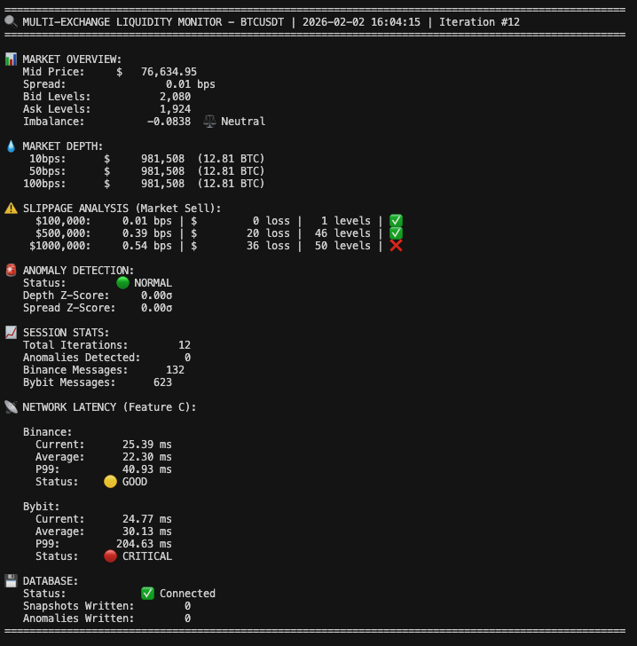
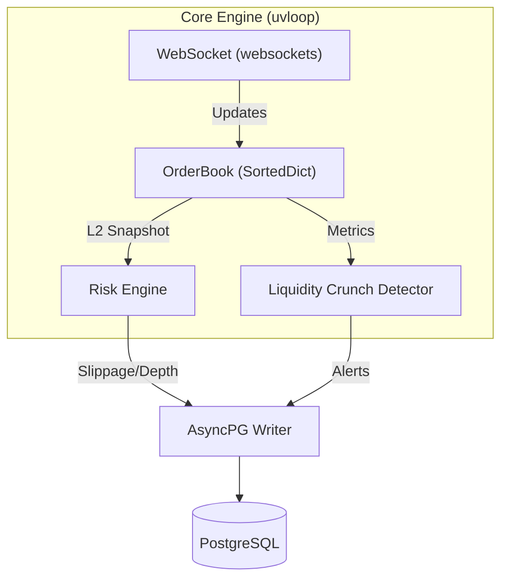
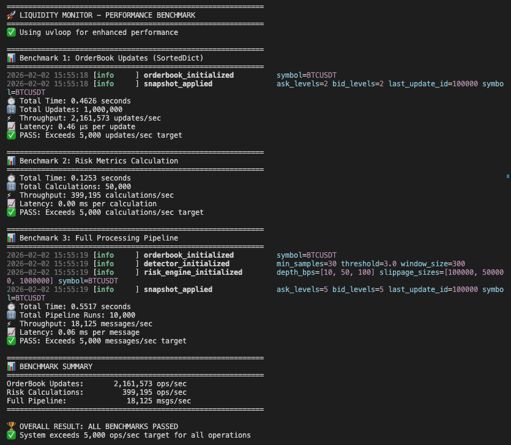

# Liquidity Crunch Monitor

[](https://github.com/JudyChang-TW/liquidity-crunch-monitor/actions/workflows/ci.yml)
[](https://codecov.io/gh/JudyChang-TW/liquidity-crunch-monitor)
[](https://www.python.org/downloads/)
[](https://opensource.org/licenses/MIT)

High-frequency risk engine for real-time crypto market monitoring.
Reconstructs L2 order books via WebSocket streams to detect liquidity anomalies and calculate execution slippage.

> **Coverage Strategy**: Core logic (OrderBook, RiskEngine) maintains 85%+ coverage.
> Infrastructure components (connectors, database) are tested via integration tests.


## Demo

*(Real-time CLI dashboard monitoring Binance/Bybit spreads and slippage)*


## Architecture

Data flow: `Binance WS` -> `Asyncio/uvloop` -> `SortedDict OrderBook` -> `Risk Metrics` -> `PostgreSQL`




## Technical Specs

| Component | Implementation | Rationale |
| :--- | :--- | :--- |
| **Concurrency** | `asyncio` + `uvloop` | Non-blocking I/O, **2-4x throughput** vs default loop |
| **Data Structure** | `SortedDict` | **O(log n)** insertions/deletions (optimal for OrderBook) |
| **Numeric Type** | `Decimal` (Python) | **Exact precision** for prices (avoids floating-point errors) |
| **Protocol** | WebSocket (Stream) | Push-based real-time updates (vs REST polling) |
| **Persistence** | PostgreSQL + AsyncPG | High-throughput asynchronous write operations |


## Performance Benchmarks

To ensure the system meets high-frequency trading requirements, the internal engine was stress-tested using a dedicated benchmark script.

**Environment:** MacBook Pro (Apple Silicon)

**Results (Single Core):**

| Metric | Throughput | Description |
|--------|------------|-------------|
| **Full Pipeline** | **18,200+ msgs/sec** | End-to-end processing (Parsing → OrderBook → Risk Engine → Database Prep) |
| **OrderBook Updates** | **2,000,000+ ops/sec** | Pure data structure efficiency using `SortedDict` (O(log n)) |
| **Risk Calculations** | **390,000+ ops/sec** | Slippage, Imbalance, and Z-Score calculations |
| **Internal Latency** | **< 1 ms** | Average processing time per tick |

### Benchmark Run Output

*(Actual output from `benchmark_test.py` validating system throughput and latency)*

> *Note: While Exchange API rate limits (WebSocket) restrict real-world data ingestion to ~10-100 updates/sec, this benchmark validates the engine's capacity to handle extreme volatility or multi-exchange feeds without bottlenecks.*

### How to Run Benchmark
You can reproduce these results by running the included stress test script:
```bash
python benchmark_test.py

```


## Setup

```bash
# 1. Install
python -m venv venv && source venv/bin/activate
pip install -e ".[dev]"
pre-commit install

# 2. Environment Variables (REQUIRED)
cp .env.example .env.local
nano .env.local  # Set DB_PASSWORD (REQUIRED)

# Export environment variables
export $(cat .env.local | xargs)

# 3. Config
# Edit config/settings.yaml for symbol selection
```

**Security Note:** Database password is REQUIRED. The application will fail fast if `DB_PASSWORD` environment variable is not set. See `.env.example` for setup instructions.

## Usage

```bash
# Start Monitor
python main.py --symbol BTCUSDT

# Or use the script
python scripts/run_monitor.py

# Run Examples
python examples/simple_example.py
python examples/multi_exchange_demo.py
```

## Development & Testing

### Local Testing
```bash
# Run tests locally
pytest tests/unit/ -v
pytest tests/integration/ -v

# Run pre-commit checks
pre-commit run --all-files

# Use Makefile shortcuts
make test          # Run all tests
make lint          # Run linting
make check         # Run format + lint + test
```


## Project Structure

```
src/liquidity_monitor/
├── core/           # OrderBook (SortedDict)
├── analytics/      # Risk Engine (Slippage, Depth, Imbalance)
├── connectors/     # Binance, Bybit, Multi-Exchange WebSocket
├── database/       # AsyncPG Writer
├── metrics/        # Metric calculation utilities
└── utils/          # Logger, Latency Monitor

tests/
├── unit/           # OrderBook, Risk Engine tests
└── integration/    # WebSocket integration tests
```
